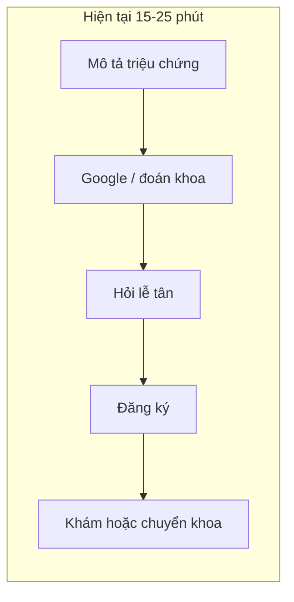
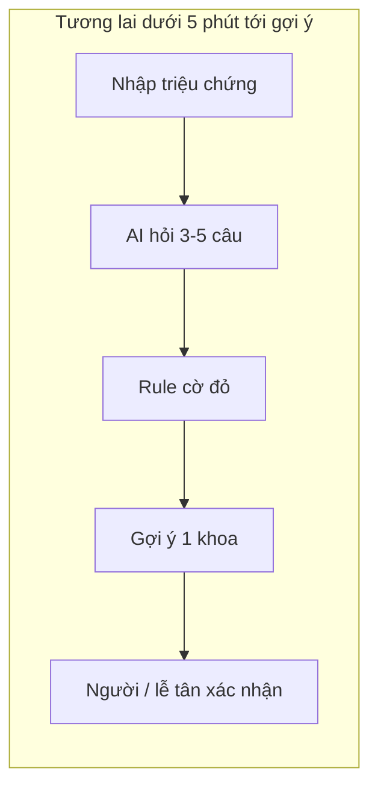
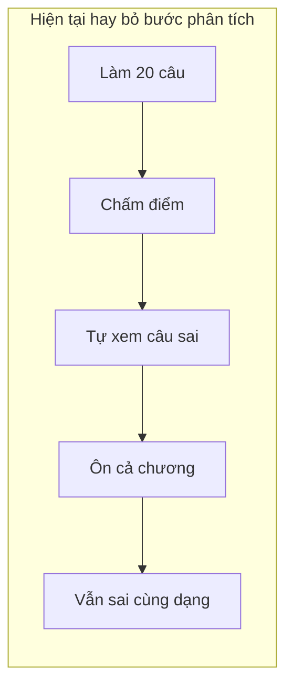
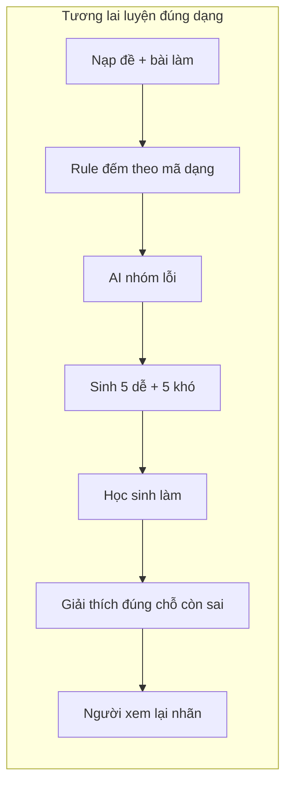
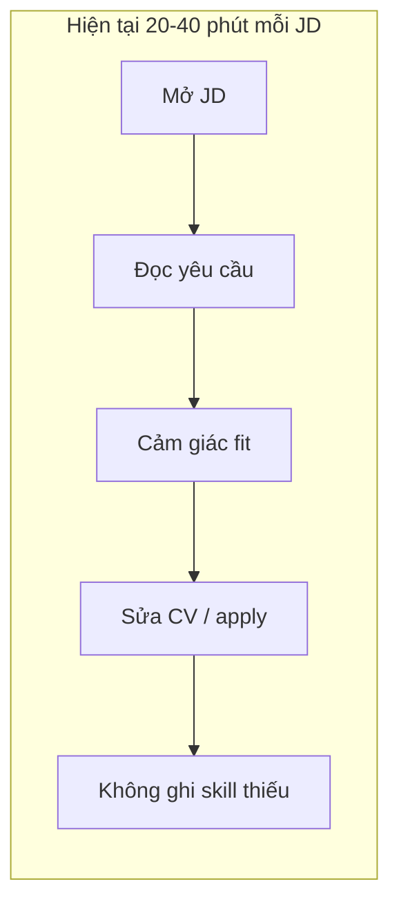
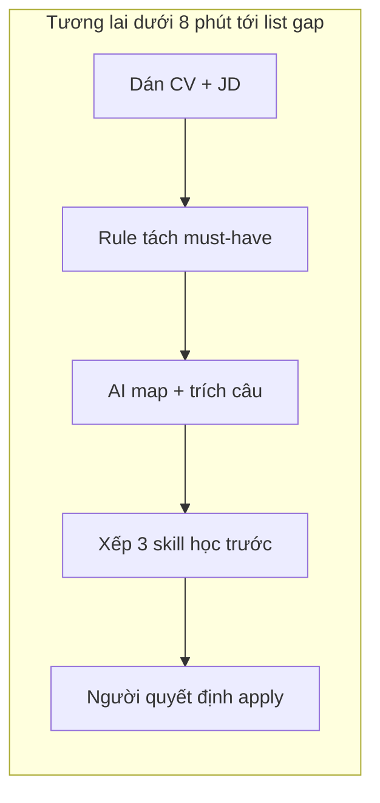

# 01 — Individual Problem Scan

> Điền theo Phase 1 + Phase 2 trong `01-worksheet.md`. Tự scan trước, dùng AI sau để phản biện. Không copy ví dụ Weekly Report.

## Thông tin cá nhân

- Họ và tên: Mai Tiến Huy
- Mã học viên: 2A202602914
- Vai trò / bối cảnh: sinh viên đã tốt nghiệp.
- Công việc hằng tuần (3-5 gạch đầu dòng để soi problem):
  - Làm side project nhóm 2 người cho một trung tâm giáo dục
  - Đọc JD, sửa CV khi tìm việc làm thêm hoặc thực tập
  - Đi khám hoặc nghe người nhà hỏi “đau thế này khám khoa nào?”
  - Họp nhóm đồ án: chép việc từ chat, tìm lại quyết định cũ, bị hỏi “ai làm gì / họp lúc nào”
  - Rà deadline LMS + Discord + email; thỉnh thoảng gõ lại chi tiêu từ app ngân hàng
  - thảo luận với một vài người bạn bên luật để giải quyết tình huống hàng ngày

---

## Phase 1 — Scan 5+ problems (tối thiểu 5, khuyến khích 8-10)

**Cách điền:** mỗi dòng = việc gì + ai chịu + đo bằng gì. Cột `Dấu hiệu thật` bắt buộc có số. Số có nhãn: **tự bấm giờ**, **quan sát / ước**, hoặc **chưa đo tại 1 cơ sở**.

| # | Lăng kính (Lặp lại / Tốn thời gian / AI có thể tốt hơn / Pain từ người khác) | Problem quan sát được | Ai chịu ảnh hưởng? | Dấu hiệu thật (số + bằng chứng) |
|---|---|---|---|---|
| 1 | AI có thể tốt hơn + Pain từ người khác | **Y tế:** có triệu chứng đời thường (“đau đầu, chóng mặt, buồn nôn”) không biết đăng ký khoa nào; hỏi lễ tân hoặc chọn nhầm rồi bị chuyển khoa | Người bệnh / người nhà tự đăng ký; lễ tân; bác sĩ khoa nhận nhầm | **Quan sát / ước** khi đi cùng người nhà giờ cao điểm: lễ tân trả lời cùng kiểu câu nhiều lần/buổi. 1 lần chọn nhầm = xếp hàng lại, **ước** thêm 20–45'. **Chưa đo** số chuyển khoa / 100 lượt tại 1 cơ sở. |
| 2 | AI có thể tốt hơn + Tốn thời gian | **Học tập:** sau đề ~20 câu chỉ thấy điểm (vd. 12/20), không biết yếu dạng nào / bước nào nên ôn cả chương | Học sinh THCS–THPT hoặc SV tự ôn; giáo viên muốn giao bài bù đúng lỗi | **Tự ước** khi ôn 1 đề: làm 30–45', chấm ~5', xem câu sai hay bỏ hoặc mất 10–20'. Ôn lại cả chương dù chỉ sai 1 dạng: thêm 30–90'. **Chưa chấm** 1 lớp để đếm “ôn nhầm chương”. |
| 3 | Tốn thời gian + AI có thể tốt hơn | **Việc làm:** đọc nhiều JD vẫn không biết thiếu skill gì so với CV thật, apply cảm tính rồi bị loại vòng CV | SV mới / người chuyển việc tự apply, không có career coach | **Tự ước** tuần săn thực tập: 5–10 JD × 20–40'/JD. Skill thiếu lặp (SQL, portfolio, tiếng Anh) nhưng không được ghi ra. **Chưa log** 20 lượt apply để đếm tỷ lệ loại sớm. |
| 4 | Lặp lại + Tốn thời gian | **Nhóm:** họp xong tự chép việc từ ghi âm / chat Zalo–Discord vào tracker | Người ghi chú, cả nhóm đồ án | **Tự ước** 30–45'/buổi; tuần 2–3 buổi. Việc không có owner hay bị rơi tới họp sau. |
| 5 | Tốn thời gian | **Nhóm / lớp:** tìm lại quyết định cũ (“deadline nào?”, “ai nhận slide?”) vì search chat chỉ khớp từ khóa | Thành viên nhóm, học viên trong kênh | **Tự ước** 10–15'/lần: thử 2–3 keyword, mở 4–6 thread. Tuần hỏi lại cùng câu 3–5 lần. |
| 6 | Lặp lại + Tốn thời gian | **Học tập:** deadline nằm rải LMS + Discord + email; nhập tay vào lịch, dễ sót | SV học nhiều môn song song | **Tự ước** 20–30'/tuần nhập tay. Pain là sót hạn, không phải “gõ chậm”. **Chưa đếm** số deadline sót / kỳ trên lịch của mình. |
| 7 | Pain từ người khác | **Nhóm:** bạn hỏi lại lịch họp / ai làm gì vì note nằm nhiều thread | Cả nhóm, người đang giữ file | **Quan sát** 5–8 tin hỏi lại/tuần trên nhóm đồ án. Cùng câu “họp lúc mấy giờ / ai làm phần nào”. |
| 8 | Tốn thời gian | **Học tập:** đọc slide + PDF + clip trước deadline, không biết đoạn nào phải nhớ nên đọc hết | SV ôn thi / làm bài | **Tự ước** 45–90'/tài liệu. Đọc xong vẫn không chốt được 3 ý phải thuộc. |
| 9 | Lặp lại | **Nộp bài:** mỗi lần nộp lại đi tìm file cũ, copy format, sửa heading / mục lục thủ công | SV, thành viên làm phần ghép file | **Tự ước** 20–30'/bài × 2–3 bài/tuần. Phần lớn là format, không phải nội dung mới. |
| 10 | Lặp lại + Tốn thời gian | **Chi tiêu:** đọc SMS / app ngân hàng rồi gõ lại số tiền + danh mục vào sheet | Bản thân khi sống tự lập | **Tự ước** 20–30'/tuần. Lệch 1–2 món thì ngồi dò lại ~10–15'. |

> Tự soi: tuần trước mất nhiều thời gian nhất vào ôn đề + đọc JD. Việc hay trì hoãn: xem câu sai sau khi chấm. Người khác hay hỏi: “khám khoa nào?” và “ai làm phần nào?”. Workflow nhóm ai cũng biết chậm: chép việc sau họp + lục chat.

**Vì sao dòng 4–10 không vào top 3:** #4–#7 và #9 gần No AI / Rule (template, lịch chung, pin tin). #8 quá rộng (“đọc hiểu”). #10 đủ Rule/regex. Giữ lại để scan đủ lăng kính, không pitch.

**AI đã dùng ở Phase 1 (nếu có):**
- Prompt: sau khi tự có 3 hướng (điều hướng khám, gap kiến thức, skill gap JD), nhờ mở thành dòng có actor + bottleneck + metric; không viết chatbot bác sĩ / gia sư / career coach.
- Ý dùng được: siết 3 bài top (dòng 1–3) cho có số đo và boundary.
- Ý bỏ: “AI chẩn đoán bệnh”, “AI thay giáo viên”, “AI tự apply hộ”.
- Dòng 4–10: tự soi từ họp nhóm / ôn / nộp bài / chi tiêu, không lấy từ AI.

**Self-check Phase 1:**
- [x] Đủ 5+ dòng, mỗi dòng có actor + số đo cụ thể
- [x] Dùng ít nhất 3/4 lăng kính (đủ 4)
- [x] Không có dòng chung chung kiểu "mất nhiều thời gian"

---

## Phase 2 — Top 3 Problem Cards

### 2.1. Chọn top 3

Giữ bài nào: actor cụ thể, workflow vẽ được 3-7 bước, bottleneck ở 1 bước, impact đo được. Loại bài quá rộng.

| Rank | Problem (copy từ bảng scan) | Vì sao chọn (2-3 ý) | Điều còn chưa chắc |
|---|---|---|---|
| 1 | Điều hướng khám bệnh theo triệu chứng (không chẩn đoán) | Actor rõ (người nhà / bệnh nhân tự đăng ký, không phải bác sĩ). Bottleneck một bước: map triệu chứng đời thường → khoa. Metric đo được (đúng khoa lần đầu, phút chọn khoa, số chuyển khoa). So sánh Rule / Workflow / Agent được. | Baseline chuyển khoa **chưa đo** tại 1 bệnh viện. AI sai có giá sức khỏe — dễ trượt sang chẩn đoán. |
| 2 | Phát hiện lỗ hổng kiến thức sau khi làm đề | Pain cụ thể: không biết yếu đâu, không phải “AI dạy học”. Workflow ôn → test lại vẽ được. Tự lấy 1 đề 20 câu vào lab được ngay. | Rubric “yếu bước nào” (chuyển vế / dấu) cần lời giải từng bước, không chỉ đúng/sai. |
| 3 | Đọc JD + CV nhưng không thấy skill gap | Actor là đúng việc mình đang làm. Thời gian đọc JD đo được. AI hợp bước so khớp ngôn ngữ. | “Phù hợp” dễ cảm tính. Jobscan / Teal đã làm một phần. |

---

### 2.2. Problem Cards chi tiết

---

#### Problem Card #1 — Điều hướng khám bệnh (không chẩn đoán)

```text
Problem 1 câu:
Người có triệu chứng (vd. đau đầu, chóng mặt, buồn nôn) không biết đăng ký khoa nào,
nên hỏi lễ tân hoặc chọn nhầm — mất thời gian và phải chuyển khoa.

Actor:
Người bệnh / người nhà tự đăng ký khám (phòng khám đa khoa hoặc BV tuyến huyện/tỉnh),
không phải bác sĩ. Lễ tân chịu tải câu hỏi lặp.

Thời điểm / bối cảnh:
Trước khi lấy số / chọn chuyên khoa trên kiosk, app, hoặc quầy. Giờ cao điểm sáng.

Current workflow 3-7 bước:
1. Cảm thấy triệu chứng, quyết định đi khám
2. Tự đoán khoa hoặc Google “đau đầu khám khoa nào”
3. Hỏi lễ tân / người đi cùng
4. Chọn khoa trên phiếu / app
5. Xếp hàng, vào khám
6. (Nếu sai) bác sĩ bảo chuyển khoa → xếp hàng lại

Bottleneck:
Bước 2–4: map triệu chứng đời thường → khoa phù hợp ban đầu.
Không có checklist câu hỏi (kéo dài bao lâu, sốt, khó thở, tiền sử).

Impact:
Mỗi lần chọn nhầm = thêm 20–45 phút + 1 lượt chuyển khoa (ước, chưa đo tại 1 cơ sở).
Lễ tân lặp lại cùng kiểu câu nhiều lần/buổi. Khoa nhận nhầm mất slot.

Success metric:
(1) Tỷ lệ lần đầu chọn đúng khoa (pilot: so với hướng dẫn lễ tân/bác sĩ).
(2) Thời gian từ “có triệu chứng mô tả được” → “đã chọn khoa”: giảm từ ~15–25' xuống dưới 5'.
(3) Số lần phải chuyển khoa / 100 lượt đăng ký giảm — cần baseline tại 1 cơ sở trước khi khoe %.

Non-AI alternative:
Sơ đồ “nếu đau ngực → cấp cứu / tim mạch” in tại quầy; lễ tân đọc script 5 câu.
Đủ cho vài tình huống đỏ, không đủ khi triệu chứng mơ hồ, nhiều khoa.

AI hypothesis:
AI hỏi 3–5 câu làm rõ, rồi gợi ý 1 khoa ưu tiên + điều kiện đi khám sớm.
Không chẩn đoán bệnh, không kê đơn, không nói “bạn bị X”.

Quick gut:
[ ] No AI / process fix
[ ] Rule
[x] Workflow
[ ] Agent
[ ] Chưa biết
```

**Vì sao có impact:** bottleneck là một quyết định trước quầy, không phải “xây bác sĩ AI”. Sai một bước = xếp hàng lại. Rule (sơ đồ cờ đỏ) đã đủ cho đau ngực / khó thở; AI chỉ đáng thử khi triệu chứng mơ hồ. Impact xã hội lớn nhưng **rủi ro sức khỏe** cũng lớn nhất trong 3 card.

**Draft workflow Card #1:**

```text
CURRENT STATE — 15–25' chọn khoa + rủi ro chuyển khoa 20–45'

[1 Mô tả triệu chứng: 2']
→ [2 Google / đoán khoa: 8–15']  <-- bottleneck
→ [3 Hỏi lễ tân: 3–5']
→ [4 Đăng ký: 2']
→ [5 Khám / bị chuyển khoa: +20–45']

FUTURE STATE — dưới 5' tới gợi ý khoa (chưa tính xếp hàng)

[1 User nhập triệu chứng: 1']
→ [2 AI hỏi 3–5 câu (kéo dài, sốt, khó thở, tiền sử): 2']
→ [3 Rule: nếu có “cờ đỏ” → bảo đi cấp cứu / khám sớm: 0']
→ [4 AI gợi ý 1 khoa + câu “nếu có X,Y,Z thì đi sớm”: 30"]
→ [5 User / lễ tân xác nhận rồi đăng ký: 1']  <-- human boundary

Fallback: triệu chứng ngoài script / cờ đỏ / AI không chắc
→ không gợi ý khoa, bảo đến lễ tân hoặc cấp cứu.
Không được đoán bệnh.
```





Không xuất PNG riêng. Bottleneck = bước đoán khoa. Boundary = lễ tân / người xác nhận. Fallback = không gợi ý khoa.

---

#### Problem Card #2 — Phát hiện lỗ hổng kiến thức cá nhân

```text
Problem 1 câu:
Sau một đề (vd. 20 câu toán), học sinh chỉ thấy điểm 12/20, không biết mình
yếu dạng nào / bước nào, nên ôn lan man thay vì bù đúng lỗ hổng.

Actor:
Học sinh THCS–THPT hoặc sinh viên tự ôn; giáo viên muốn giao bài luyện theo lỗi.

Thời điểm / bối cảnh:
Sau khi chấm xong 1 đề / 1 bài kiểm tra trên giấy hoặc quiz online.

Current workflow 3-7 bước:
1. Làm đề
2. Đối đáp án, cộng điểm
3. Xem câu sai (nếu có thời gian)
4. Tự đoán “mình kém chương này”
5. Ôn cả chương hoặc làm đề mới ngẫu nhiên
6. Kiểm tra lại sau vài ngày — vẫn sai cùng dạng

Bottleneck:
Bước 3–4: từ danh sách câu sai → nhóm theo dạng + bước sai
(vd. 4 câu phương trình, đặc biệt chuyển vế / xử lý dấu).
Học sinh dừng ở “được 12/20”.

Impact:
30–60 phút/đề + thêm 1–2 giờ ôn không đúng chỗ (tự ước trên đề của mình).
Giáo viên không kịp phân tích từng em. Lỗ hổng lặp lại qua nhiều đề.

Success metric:
(1) Thời gian từ “có đáp án” → “có 1 skill gap + bộ câu luyện”: từ ~20–40' xuống dưới 5'.
(2) Trên dạng đã gắn nhãn yếu: tỷ lệ đúng ở bộ kiểm tra lại tăng (vd. 1/5 → ≥4/5) sau 1 vòng luyện.
(3) Số dạng ôn “không liên quan câu sai” giảm về 0 trong phiên đó.

Non-AI alternative:
Giáo viên soạn ma trận đề (câu 1–5 phương trình, 6–10 phân số…).
Học sinh đếm số sai theo cột. Đủ nếu đề đã gắn nhãn; không chỉ ra “sai ở bước dấu”.

AI hypothesis:
AI đọc câu sai + lời làm (nếu có) → nhóm dạng → chỉ bước yếu
→ sinh 5 câu cơ bản → 5 câu nâng → kiểm tra lại → nếu vẫn sai thì giải thích lại đúng phần đó.
Không thay giáo viên chấm điểm chính thức, không tự quyết định “em giỏi/yếu cả môn”.

Quick gut:
[ ] No AI / process fix
[ ] Rule
[x] Workflow
[ ] Agent
[ ] Chưa biết
```

**Vì sao có impact:** pain không phải “thiếu gia sư”, mà là bước sau khi đã có điểm. Tự validate bằng 1 đề 20 câu. Nếu đề đã tag dạng thì Rule đếm đủ ~70% — AI chỉ khi cần đọc lời làm / sinh câu cùng dạng. Rủi ro thấp hơn card khám bệnh.

**Draft workflow Card #2:**

```text
CURRENT STATE — 20–40' tự phân tích (thường bỏ) + ôn lan man

[1 Làm 20 câu: 30–45']
→ [2 Chấm điểm: 5']
→ [3 Tự xem câu sai: 10–20']  <-- bottleneck (hay bỏ)
→ [4 Ôn cả chương / đề random: 30–90']
→ [5 Làm đề khác: vẫn sai cùng dạng]

FUTURE STATE — dưới 5' có gap + 15–25' luyện đúng chỗ

[1 Nạp đề + đáp án + bài làm: 1']
→ [2 Rule đếm đúng/sai theo mã dạng (nếu đề đã tag): 10"]
→ [3 AI nhóm lỗi + chỉ bước yếu: 1']
→ [4 AI sinh 5 dễ → 5 khó: 1']
→ [5 Học sinh làm + hệ thống chấm: 15']
→ [6 Nếu vẫn sai: AI giải thích lại ĐÚNG phần đó: 5']
→ [7 Giáo viên / học sinh xem lại nhãn dạng: 2']  <-- human boundary

Fallback: đề không có lời giải / ngoài ngân hàng dạng
→ chỉ báo số sai theo chương (Rule), không bịa “bạn yếu bước dấu”.
```





Không xuất PNG riêng. Bottleneck = xem câu sai. Boundary = người xem nhãn dạng. Fallback = chỉ đếm theo chương.

---

#### Problem Card #3 — Skill gap khi đọc JD / CV

```text
Problem 1 câu:
Người tìm việc đọc nhiều JD nhưng không biết mình thiếu kỹ năng gì so với
vị trí muốn apply, nên đọc lâu, apply lệch, rồi bị loại sớm.

Actor:
Sinh viên mới ra trường hoặc người chuyển việc; tự apply, không có career coach.

Thời điểm / bối cảnh:
Mỗi tuần đọc 5–10 JD, sửa CV, bấm apply. Trước deadline thực tập / job wave.

Current workflow 3-7 bước:
1. Lướt job board, mở JD
2. Đọc 1–2 trang yêu cầu
3. Tự cảm “mình hợp ~70%”
4. Sửa CV cho “vào chữ khóa”
5. Apply
6. Im lặng / loại vòng CV — không biết thiếu skill nào lặp lại

Bottleneck:
Bước 2–3: so khớp CV thật với JD thành danh sách skill thiếu / skill đã có,
không phải đọc hết JD.

Impact:
5–10 JD/tuần × 20–40 phút (tự ước tuần săn thực tập).
Apply rồi loại sớm tốn công. Skill thiếu lặp lại nhưng không được theo dõi.

Success metric:
(1) Thời gian đọc + tự đánh giá 1 JD: 20–40' → dưới 8' (kèm list gap).
(2) Trên 20 lượt của 1 người: số apply “thiếu điều kiện cứng” giảm.
(3) ≥80% mục gap phải trích được cụm từ trong JD (không bịa skill).

Non-AI alternative:
Checklist cột: must-have trong JD vs dòng CV. Đủ nếu JD ngắn, bullet rõ.
Không đủ khi JD viết dài, trộn nice-to-have với must-have.

AI hypothesis:
AI đọc CV + JD → mức phù hợp có căn cứ (câu JD nào khớp / thiếu)
→ 3–5 skill nên học trước + lộ trình ngắn.
Không tự apply, không hứa “sẽ đậu”, không viết CV bịa kinh nghiệm.

Quick gut:
[ ] No AI / process fix
[ ] Rule
[x] Workflow
[ ] Agent
[ ] Chưa biết
```

**Vì sao có impact:** việc mình đang làm mỗi tuần. Bottleneck là so khớp ngôn ngữ, không phải “career coach”. Metric bắt buộc trích câu trong JD — chặn % fit cảm tính. Yếu hơn #2 vì Jobscan/Teal đã phủ một phần, và “phù hợp” dễ tranh cãi.

**Draft workflow Card #3:**

```text
CURRENT STATE — 20–40'/JD × 5–10 JD/tuần

[1 Mở JD: 1']
→ [2 Đọc yêu cầu: 15–25']  <-- bottleneck
→ [3 Cảm giác fit: 5']
→ [4 Sửa CV / apply: 10–20']
→ [5 Chờ; không ghi skill thiếu]

FUTURE STATE — dưới 8'/JD tới list gap

[1 Dán CV + JD: 1']
→ [2 Rule tách must-have (nếu JD có mục Requirements): 30"]
→ [3 AI map skill CV ↔ JD + trích câu nguồn: 1']
→ [4 AI xếp 3 skill học trước + gợi ý lộ trình: 1']
→ [5 User quyết định apply / không apply: 4']  <-- human boundary

Fallback: JD không có yêu cầu rõ / CV trống
→ không chấm % fit. Chỉ liệt kê bullet JD, bảo user tự tick.
Nếu skill không có trong JD thì không được “bịa thiếu”.
```





Không xuất PNG riêng. Bottleneck = đọc JD. Boundary = người quyết định apply. Fallback = không chấm % fit.

---

### 2.3. Card muốn pitch nhất (chuẩn bị 2 phút)

**Card tôi muốn pitch nhất:**

```text
Card #2 — Phát hiện lỗ hổng kiến thức sau khi làm đề
(Card #1 mạnh về impact xã hội nhưng rủi ro sức khỏe cao;
nếu nhóm muốn bài “rõ metric + làm trong lab” thì #2 dễ chốt Go hơn.)
```

```text
┌──────────────────────────────────────────────┐
│ PROBLEM CARD #2                              │
│                                              │
│ Problem 1 câu: sau đề chỉ thấy 12/20,        │
│ không biết yếu dạng / bước nào → ôn lan man  │
│                                              │
│ Ai chịu: SV / HS tự ôn; GV muốn giao bài bù  │
│                                              │
│ Workflow: làm đề → chấm → xem sai → ôn chương│
│                                              │
│ Bước nghẽn: từ list câu sai → dạng + bước    │
│              (10–20', hay bỏ)                │
│                                              │
│ Đo: phút ra gap 20–40' → <5';                │
│     test lại đúng dạng 1/5 → ≥4/5            │
│                                              │
│ Quick gut: Workflow (Rule nếu đề đã tag)     │
└──────────────────────────────────────────────┘
```

**Vì sao (2-3 câu: workflow gì, số đo gì, impact gì):**

```text
Workflow có sẵn: làm đề → chấm → ôn. Bottleneck là bước “từ 12/20 ra được
mình yếu dạng nào / bước nào”, không phải “xây gia sư AI”. Metric đo được:
phút ra gap, tỷ lệ đúng khi kiểm tra lại đúng dạng đó. Tự validate bằng
1 đề toán/quiz. Boundary rõ: không thay giáo viên, không chẩn đoán
“học kém cả môn”.
```

**Câu hỏi tôi muốn nhóm challenge (1-2 câu hỏi đúng chỗ yếu):**

```text
1) Nếu đề chỉ có đúng/sai, không có bài làm từng bước, AI có đang bịa
   “sai ở bước chuyển vế” không?
2) Rule gắn mã dạng sẵn trên đề đã giải 70% chưa — lúc đó còn cần AI?
```

**AI phản biện Card (nếu có):**
- Điểm yếu AI chỉ ra: Card khám bệnh dễ trượt sang chẩn đoán; Card JD dễ thành % fit cảm tính; Card học dễ bịa bước sai nếu không có lời giải.
- Tôi sửa gì: mọi card đều có fallback “không chắc thì đừng nói”; metric JD bắt buộc trích câu trong JD; metric học ưu tiên đề có tag dạng + bài làm.

### Self-check nộp phần 01
- [x] Có 5+ problems + top 3 Cards đủ field
- [x] Mỗi Card có workflow trước/sau + bottleneck + metric + fallback
- [x] Đã chọn 1 card pitch + câu hỏi challenge
